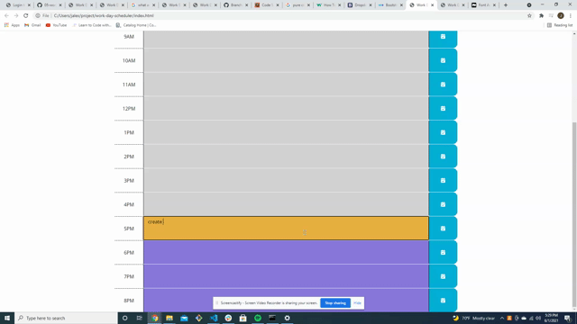

# work-day-scheduler

Project shows a day planer with time blocks.

The current day is displayed at the top of the calendar.

Time blocks are color coded according to past, present or future.

Clicking on a time block allows an event to be entered, and clicking the save button stores it in local storage.